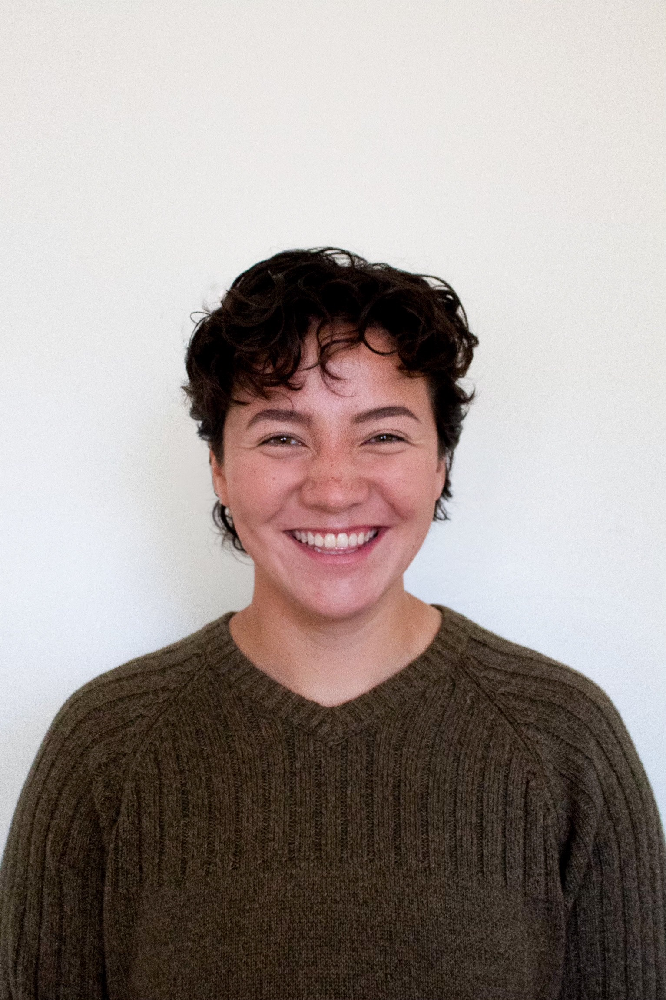
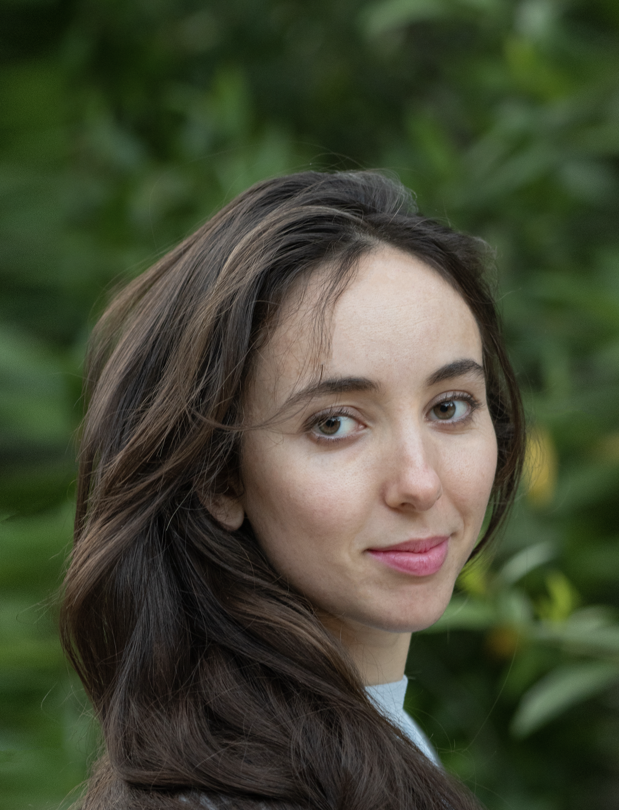
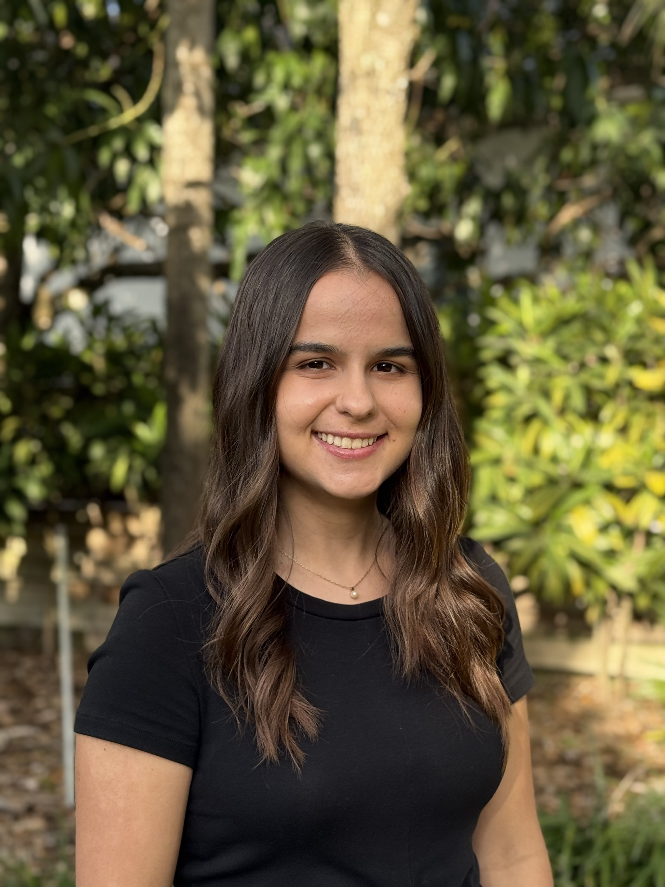
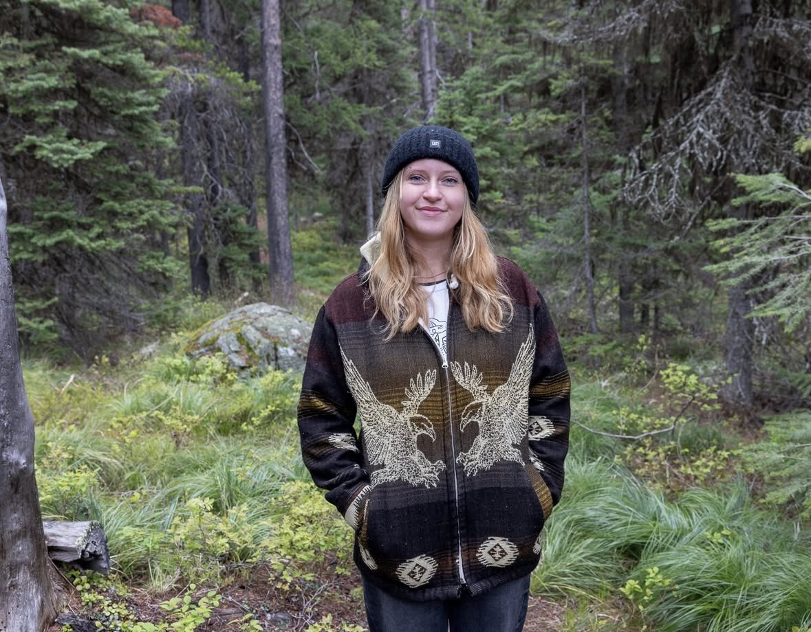

## PhD Students

### JD Reigrut

::::: columns
::: {.column width="75%"}
I am a first year Dean’s Fellow and PhD student in Environmental Science in Policy. I graduated with honors from Vassar College in 2025 with a degree in Biology, and a minor in Earth Science. Previously, I worked on the TEMPO project at UC Santa Barbara, studying community- based temporary fishery closures.

My current research focuses on creating equitable social-ecological solutions for fisheries management. For my dissertation, I aim to use quantitative and qualitative modeling methods to investigate how who designs fishery closures impacts who benefits from them.
:::

::: {.column width="25%"}

:::
:::::

### Gabriella Berman

::::: columns
::: {.column width="75%"}
I am a fourth year JD/PhD student in the Department of Environmental Science and Policy where I conduct interdisciplinary research applying geocomputational tools and legal scholarship to study resource extraction and biodiversity in the high seas. I earned my J.D. with a concentration in environmental law from the University of Miami’s School of Law in December 2024. I also hold an M.S. in marine biology from Scripps Institution of Oceanography at the University of California San Diego where I used genetic tools to discover new deep-sea species and study their ranges, as well as a B.S. in biology with a concentration in genetics and evolution from the University of Montana where I studied the evolution of large horns in Japanese rhinoceros beetles. I am originally from Maui, Hawai’i and passionate about all things related to the ocean.
:::

::: {.column width="25%"}

:::
:::::

## Master's Students

### Emily Rodriguez

::::: columns
::: {.column width="75%"}
I am a Master's of Professional Science student in the Coastal Zone Management track. I graduated from the University of Miami in 2025 with a degree in Marine Biology and Ecology and a minor in Marine Policy. I have previously worked in species distribution modeling of sandbar sharks in relation to policy changes.

My current work and research focuses on compiling catch and effort data from Regional Fisheries Management Organizations (RFMOs) into a single, harmonized dataset. I will use this dataset to test the "Blue Paradox": the phenomenon in which fishers intensify fishing effort in areas designated for closure during the window between policy announcement and formal implementation.
:::

::: {.column width="25%"}

:::
:::::

## Undergraduate students

### Maggie Smith

::::: columns
::: {.column width="75%"}
I am a third year undergraduate student at the University of Miami pursuing a major in marine affairs with a minor in ecosystem science and policy. I am currently working on populating a database of large scale marine protected areas (LSMPAs) in locations that are intensively fished for tuna. The goal is to bridge the research gap between LSMPAs and highly migratory species to understand the efficacy of these management policies in their broader goal of conservation. Due to extensive policy shifts concerning the Pacific Islands Heritage Marine National Monument from its creation to present day, I am also focused on creating a comprehensive timeline of the monument and tuna fishing activity throughout each policy change.
:::

::: {.column width="25%"}

:::
:::::

## Past students

::::: columns
::: {.column width="25%"}

:::
:::::

## PI - Juan Carlos Villaseñor-Derbez

::::: columns
::: {.column width="75%"}
I am an Assistant Professor in the [Department of Environmental Science and Policy](https://environmental-science-policy.earth.miami.edu/) and a Core Faculty member at the [Frost Institute for Data Science and Computing](https://idsc.miami.edu/research/earth-systems/). I hold a B.Sc. in Oceanography from UABC (Mexico), and a master's and Ph.D. in Environmental Science and Management from the Bren School of Environmental Science & Management at UC Santa Barbara.

I use modern data science tools, extensive vessel-tracking data to study the human dimensions of marine policy and environmental change, with a focus on our [three pillars](about.qmd#our-three-pillars). I am part of the [Ocean100+ Steering Committee](https://imber.info/steering-committee-action-plan-for-the-ocean/) and the Society for Conservation Biology's [Impact Evaluation Working Group](https://scb-impact.org/) Mentoring Program.

:::

::: {.column width="25%"}

---

- [Contact](jc_villasenor@miami.edu)
- [Google Scholar](https://scholar.google.com/citations?user=y-HmU0AAAAAJ&hl=en)
- [Personal website](https://villasenor-derbez.com/)

---
:::
:::::
